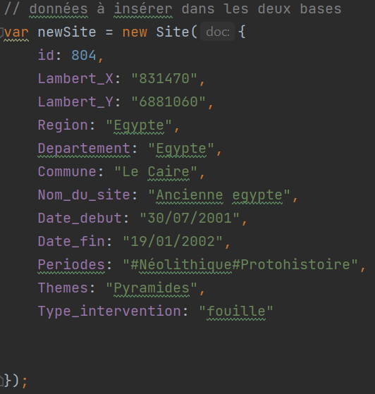
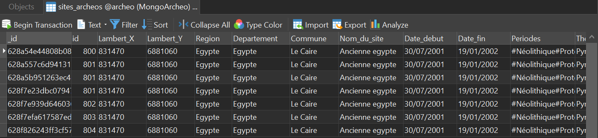
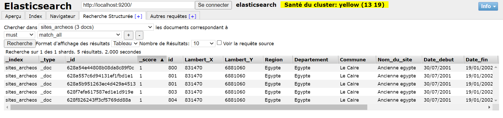

# NodeJS + MongoDB + ElasticSearch

Le thème est "Les sites archéologiques"

Dans ce projet, il est montré comment inserer des données à la fois dans une base de données MongoDB et un index dans ElasticSearch

Pour cela, mongoose et mongoosastic sont utilisés.

- Mongoose est un outil de modélisation d'objets MongoDB conçu pour fonctionner dans un environnement asynchrone. Mongoose supporte à la fois les promesses et les callbacks
- Mongoosastic est un plugin Mongoose qui permet d'indexer automatiquement vos modèles dans elasticsearch.

## Installation du projet

1. Téléchargez le projet
2. Installez les plugins
3. Lancez ElasticSearch et MongoDB
4. Modifiez toutes les données comme bon vous semble pour avoir différents sites dans vos bases.

5. Lancez le projet

Maintenant, vous pouvez aller vérifier l'insertion de votre site archéologique.

- Base de données archeo (Collection sites_archeos)

- Index (sites_archeos)  
  